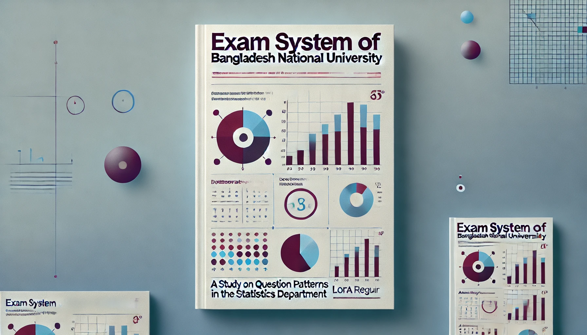

# Exam System of Bangladesh National University (BNU): A Study on Question Patterns in the Statistics Department

## Abstract

This repository presents a comprehensive study on the exam system at **Bangladesh National University (BNU)**, focusing on the **Statistics Department**. The research analyzes the question patterns over the years and their impact on student performance. This study compares these patterns with those from other universities (both public and private) and explores potential improvements to the exam system. Ultimately, the aim is to provide actionable insights for reforming the current system to enhance academic outcomes and better prepare students for professional careers.

## Keywords
- Exam System  
- Bangladesh National University  
- Statistics Department  
- Question Patterns  
- Educational Research  
- Student Performance  
- Academic Reform  

---

## Table of Contents
1. [Abstract](#abstract)
2. [Repository Overview](#repository-overview)
3. [Introduction](#introduction)
4. [Research Questions](#research-questions)
5. [Literature Review](#literature-review)
6. [Research Methodology](#research-methodology)
7. [Results & Discussion](#results-and-discussion)
8. [Conclusion](#conclusion)
9. [Future Work](#future-work)
10. [Resources](#resources)
11. [References](#references)
12. [Appendices](#appendices)

---

## Repository Overview

This repository contains all relevant documentation, research findings, and resources associated with the study on the exam system at **Bangladesh National University (BNU)**, particularly in the **Statistics Department**. The goal is to explore the exam question patterns, their impact on student performance, and compare them with those of other institutions to suggest potential improvements.

---

## Introduction

The exam system at **Bangladesh National University (BNU)** has been criticized for its flaws, particularly in the **Statistics Department**. This study aims to analyze the exam question patterns, compare them with other universities, and examine their impact on student performance. By identifying key issues within the system, this research seeks to offer insights into potential reforms that could lead to better academic outcomes.

---

## Research Questions

The study focuses on answering the following research questions:

1. **RQ1**: What are the trends and patterns in the exam questions of the Statistics department at Bangladesh National University over the past few years?  
2. **RQ2**: How do these question patterns compare with those of other universities (private/public)?  
3. **RQ3**: What specific aspects of the current exam patterns contribute to poor student performance in the Statistics department, and how can these be improved?  
4. **RQ4**: Is the current exam system in the Statistics department at Bangladesh National University beneficial for students' future careers?  
5. **RQ5**: What academic or structural challenges within the exam system contribute to student performance issues?  
6. **RQ6**: How do the exam question patterns in the Statistics department reflect the learning outcomes of the courses?  
7. **RQ7**: To what extent do the exam question patterns assess practical and applied knowledge?  
8. **RQ8**: What role does the teaching methodology play in shaping the exam question patterns?

---

## Literature Review

Several studies have explored the effectiveness of exam systems in public universities in Bangladesh, particularly in the context of the **Statistics Department** at BNU. These studies highlight the challenges of assessing practical knowledge through traditional exam methods and propose reforms for aligning assessments with real-world skills.

- **Author 1 (Year)**: *A study exploring the effectiveness of the exam system in Bangladesh and its impact on student learning.*  
- **Author 2 (Year)**: *Comparative analysis of exam patterns in public vs. private universities, highlighting discrepancies in exam difficulty and focus areas.*  

---

## Research Methodology

### Data Collection

- **Exam Paper Analysis**: The study analyzes the past 5 years of exam papers from the Statistics department at BNU.  
- **Interviews**: Interviews with faculty members and students will provide qualitative insights into the effectiveness of the current exam system.

### Data Analysis

- **Qualitative Analysis**: Content analysis of exam questions will be used to identify trends and patterns in question types (e.g., theoretical vs. practical).  
- **Quantitative Analysis**: Statistical analysis will compare the difficulty of exam questions and correlate these with student performance over time.

---

## Results & Discussion

### Findings

- **Trend Analysis**: Exam questions have increasingly focused on theoretical knowledge, with less emphasis on practical application.  
- **Comparison with Other Universities**: BNU's exam system tends to focus more on theory, whereas private universities like **XYZ University** emphasize practical application.

### Discussion

- **Impact on Students**: The current exam system does not adequately assess real-world application, contributing to poor student performance in practical fields.  
- **Potential Solutions**: Introducing project-based assessments and more practical questions could help bridge the gap between academic learning and industry needs.

---

## Conclusion

This study identifies significant gaps between the exam question patterns at BNU and the skills needed for professional success in the field of statistics. The research recommends revising the exam patterns to include more applied and practical questions that align with industry expectations and better prepare students for future careers.

---

## Future Work

Future research could focus on the following areas:
- The effectiveness of digital learning platforms in enhancing the exam system.
- Exploring alternative assessment methods such as flipped classrooms or project-based evaluations.
- Analyzing how teaching methods influence exam question patterns and student performance.

---

## Resources

Here are key papers and resources that inspired and contributed to this research:

- [**Challenges of Quality Higher Education in Bangladesh**](https://kiet.edu.pk/marketforces/index.php/marketforces/article/view/278)  
  Explores the educational challenges in Bangladesh, highlighting systemic issues in the BNU exam structure.

- [**Study of Bangladesh National University, 2014**](http://miurs.manarat.ac.bd/download/vol03/09.pdf)  
  Discusses BNU's academic structure and the challenges faced by students and faculty.

- [**Education Management at Tertiary Level: A Case of BNU**](https://www.researchgate.net/profile/Gouranga-Debnath-2/publication/332570860_Education_Management_AT_Tertiary_Level_A_case_of_Bangladesh_National_University_BNU/links/5cbe9eb292851c8d22fea59e/Education-Management-AT-Tertiary-Level-A-case-of-Bangladesh-National-University-BNU)  
  A study on the management of education in the tertiary sector, specifically focusing on BNU.

- [**The Examination System in Bangladesh and Its Impact**](https://link.springer.com/article/10.1186/s40468-018-0060-9)  
  Analyzes the impact of traditional exam systems on curriculum, students, and society.

- [**Online Examination Based University Management System, 2016**](http://182.160.117.219:8080/xmlui/handle/123456789/191)  
  Discusses the implementation of an online exam system for universities in Bangladesh.

- [**The Impact of Students' Socio-economic Condition on Academic Performance**](https://www.researchgate.net/profile/Md-Hossain-243/publication/321363239_The_Impact_of_Students_Socio-economic_Condition_on_Academic_Performance_in_Public_and_National_University_of_Bangladesh/links/5a1ed4e0aca272cbfbc077b6/The-Impact-of-Students-Socio-economic-Condition-on-Academic-Performance-in-Public-and-National-University-of-Bangladesh.pdf?_sg%5B0%5D=started_experiment_milestone&origin=journalDetail)  
  A study on the socio-economic factors influencing academic performance at BNU.

- [**Assessing Students' Satisfaction in Public Universities in Bangladesh: An Empirical Study, 2020**](https://koreascience.kr/article/JAKO202026061031644.page)  
  Investigates student satisfaction levels in Bangladesh's public universities, providing insight into exam-related issues.

- [**Quality in Statistics Education**](https://www.researchgate.net/profile/Pieternel-Verhoeven/publication/236179146_Verhoeven_PS_2009_Quality_in_Statistics_Education_Determinants_of_Course_Outcomes_in_Methods_Statistics_Education_at_Universities_and_Colleges_PhD_dissertation_Amsterdam_Boom_Onderwijs/links/00b7d528c86669781c000000/Verhoeven-PS-2009-Quality-in-Statistics-Education-Determinants-of-Course-Outcomes-in-Methods-Statistics-Education-at-Universities-and-Colleges-PhD-dissertation-Amsterdam-Boom-Onderwijs.pdf)  
  Discusses key factors determining the quality of statistics education.

- [**A Study on National University and Affiliated Colleges in Bangladesh, 2014**](https://fid4sa-repository.ub.uni-heidelberg.de/3446/)  
  Examines the overall functioning and issues within BNU and its affiliated colleges.

- [**Impact of Online Education on Students in Public and Private Universities Bangladesh: A Qualitative Investigation**](https://www.universepg.com/public/img/storage/journal-pdf/Impact%20of%20online%20education%20on%20students%20in%20public%20and%20private%20universities%20Bangladesh.pdf) 

- *More Papers Are Coming Soon...*

---

## References

1. **Author 1**, *Title of Paper*, Year.  
2. **Author 2**, *Title of Paper*, Year.  

[Include all references here]

---

## Appendices

### Appendix A: Survey Questions  
[List of survey questions used in the study.]

### Appendix B: Data Analysis Results  
[Include detailed data analysis results, graphs, and charts.]

---

## License

This project is licensed under the [MIT License](LICENSE).
